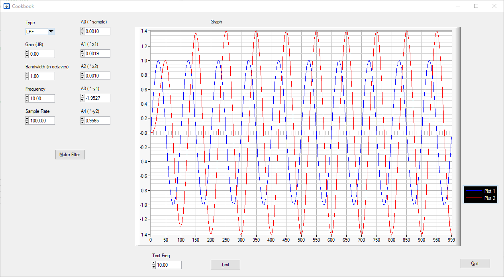

# BiQuad Filter Design Tool

This project helps one design BiQuad digital filters. BiQuad filters are Infinite Impulse Response (IIR) digital filters that are good to use in feedback control systems.  They get their name from the mathematical formula which has two quadratic functions, one in the numerator and one in the denominator, thus the bi-quad.  A BiQuad consists of five coefficients that define the frequency response and gain of the filter.  The BiQuad stores the two last outputs to reuse in subsequent calculations.  

BiQuads, and IIR filters in general, are good to use in feedback control systems because they have relatively little group delay, or phase delay.  On the other hand, Finite Impulse Response Filters (FIR), while good for audio or video systems, have long group delays which cause phase problems in a feedback control system.  BiQuad filters are popular in motor servo control systems.

## LabWindows/CVI Project

This is a project called **Cookbook** that is  written in LabWindows/CVI.

This is what the **Cookbook** app running looks like:

You enter your filter parameters on the left, press the "Make Filter" button, and the coefficients A0 through A4 are calculated.

Try out the filter by entering the "Test Freq" and pressing the "Test" button.

# Sources

The design code was adopted from public domain code:
Cookbook formulae for audio EQ biquad filter coefficients
by Robert Bristow-Johnson
